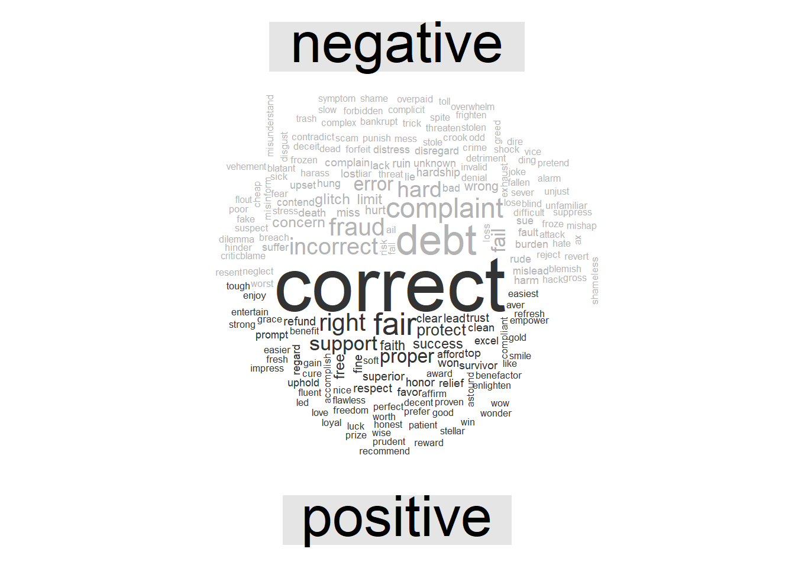
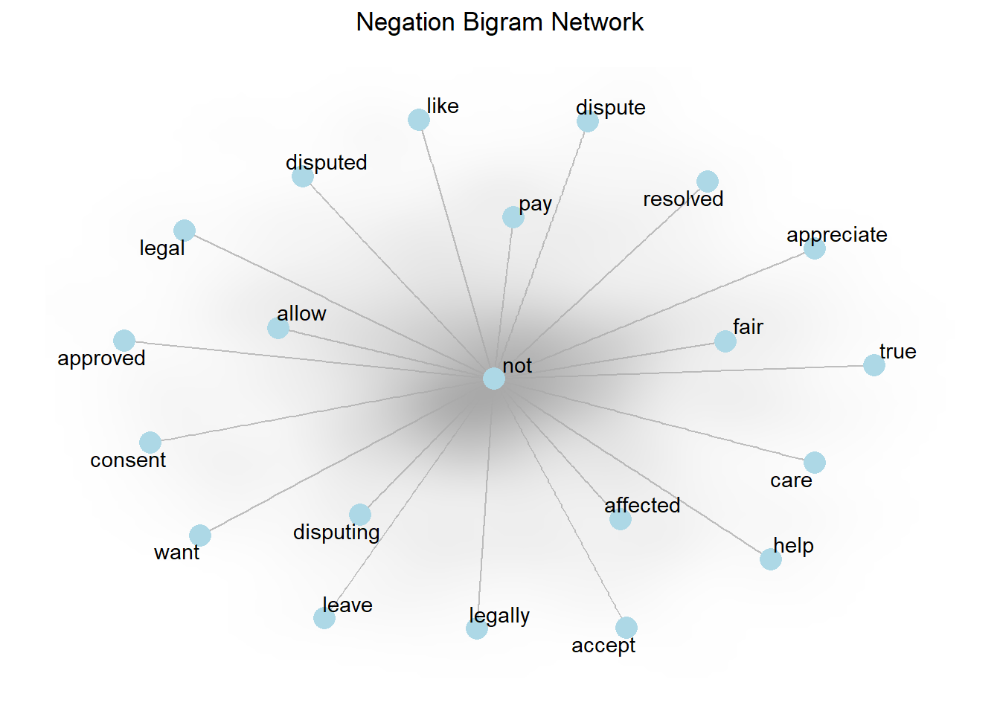
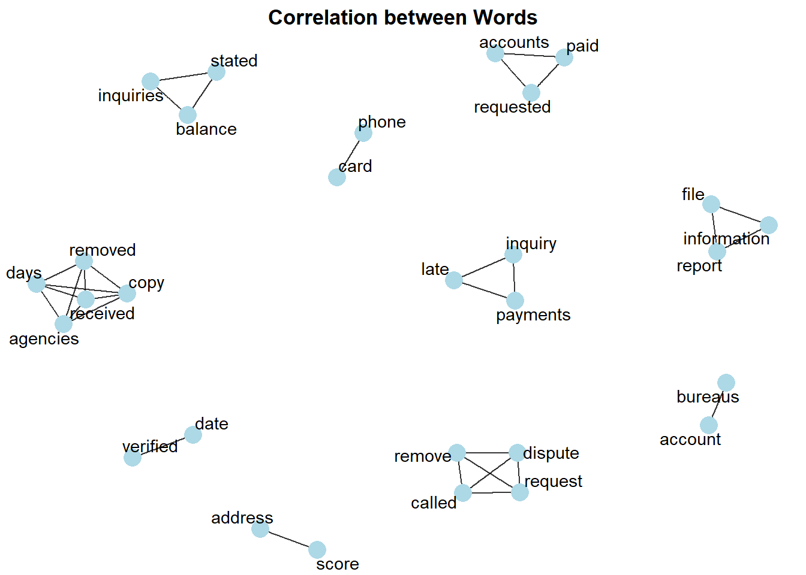

# Finance


<style>
body {
text-align: justify}
</style>


## Credit Risk Analysis 

### Background

Credit scoring membutuhkan berbagai data profil calon peminjam sehingga tingkat resiko dapat dihitung dengan tepat. Semakin benar dan lengkap data yang disediakan, maka semakin akurat perhitungan yang dilakukan. Proses tersebut tentunya merupakan hal yang baik, namun di sisi calon peminjam proses yang harus dilalui dirasa sangat merepotkan dan membutuhkan waktu untuk menunggu. Dan seiring tingkat kompetisi yang samkin tinggi di industri finansial, customer memiliki
banyak alternatif. Semakin cepat proses yang ditawarkan, semakin tinggi kesempatan untuk mendapatkan peminjam.

Tantangan pun muncul, bagaimana mendapatkan pelanggan dengan proses yang efisien namun akurasi dari credit scoring tetap tinggi. Disinilah machine learning dapat membantu menganalisa data - data profil peminjam dan proses pembayaran sehingga dapat mengeluarkan rekomendasi profil pelanggan yang beresiko rendah.

Harapannya setelah mempunyai model machine learning dengan perfomance model yang baik, pegawai bank dapat dengan mudah mengidentifikasi karakteristik customer yang memiliki peluang besar untuk melunasi pinjaman dengan lancar. Dengan adanya model machine learning ini tentunya akan mengurangi biaya dan waktu yang lebih cepat.

### Modelling Analysis


```r
loan <- read_csv("assets/02-finance/bankloans-copy.csv")%>% 
  mutate(default = factor(default, levels = c(0,1),
                          labels = c("No","Yes"))) %>% 
  rename(debtcred = creddebt)
glimpse(loan)
```

```
#> Observations: 800
#> Variables: 9
#> $ age      <dbl> 37, 25, 37, 29, 38, 32, 51, 27, 31, 37, 34, 31, 30, 31, 28...
#> $ ed       <dbl> 1, 4, 3, 1, 2, 1, 2, 3, 1, 1, 4, 1, 1, 1, 2, 1, 1, 1, 4, 2...
#> $ employ   <dbl> 20, 0, 16, 1, 13, 8, 22, 3, 1, 5, 7, 3, 11, 1, 1, 6, 14, 1...
#> $ address  <dbl> 2, 1, 14, 8, 0, 6, 23, 4, 1, 11, 15, 5, 1, 6, 4, 9, 8, 0, ...
#> $ income   <dbl> 56, 18, 50, 31, 59, 26, 120, 35, 24, 27, 40, 16, 33, 21, 1...
#> $ debtinc  <dbl> 1.9, 33.4, 36.6, 8.0, 2.4, 4.1, 7.6, 13.3, 4.5, 9.4, 6.4, ...
#> $ debtcred <dbl> 0.542640, 2.801592, 7.320000, 0.156240, 0.407808, 0.326196...
#> $ othdebt  <dbl> 0.521360, 3.210408, 10.980000, 2.323760, 1.008192, 0.73980...
#> $ default  <fct> No, Yes, Yes, No, No, No, No, No, No, NA, No, NA, No, Yes,...
```


```r
head(loan)
```

```
#> # A tibble: 6 x 9
#>     age    ed employ address income debtinc debtcred othdebt default
#>   <dbl> <dbl>  <dbl>   <dbl>  <dbl>   <dbl>    <dbl>   <dbl> <fct>  
#> 1    37     1     20       2     56     1.9    0.543   0.521 No     
#> 2    25     4      0       1     18    33.4    2.80    3.21  Yes    
#> 3    37     3     16      14     50    36.6    7.32   11.0   Yes    
#> 4    29     1      1       8     31     8      0.156   2.32  No     
#> 5    38     2     13       0     59     2.4    0.408   1.01  No     
#> 6    32     1      8       6     26     4.1    0.326   0.740 No
```


#### Exploratory Data Analysis

1. Eksplorasi hubungan target variabel dengan variabel prediktor


```r
loan %>% 
  na.omit() %>% 
ggplot(aes(x = debtinc, fill = default)) +
  geom_density(alpha = 0.5, colour = FALSE) +
  scale_x_continuous(
    expand = expand_scale(mult = c(0, 0))
  ) +
  scale_y_continuous(expand = expand_scale(mult = c(0, 0.1))) +
  scale_fill_manual(values = c("dodgerblue4","darkred")) +
  labs(
    title = "Debt to Income Rario distribution",
    subtitle = "estimated using kernel density function",
    x = "Debt to Income Ratio",
    y = "Income",
    fill = "Default Status"
  ) +
  theme_minimal() +
  theme(
    legend.position = "top",
    legend.key.height = unit(12, "pt"),
    legend.key.width = unit(36, "pt"),
  )
```


```r
loan %>% 
  na.omit() %>% 
ggplot(aes(x = debtcred, y = income)) +
  geom_point(color = "darkred") +
  geom_smooth(method = "loess", se = FALSE, color = "dodgerblue4") +
  facet_wrap(facets = vars(default), labeller = "label_both") +
  scale_y_continuous(labels = dollar_format(scale = 1e-3, suffix = "K")) +
  labs(
    title = "The relation of credit to debt ratio and income",
    subtitle = "for each default status",
    x = "Debt to Credit Ratio",
    y = "Income"
  ) +
  theme_minimal()
```


2. Check missing value


```r
loan %>% 
  is.na() %>% 
  colSums() %>% 
  enframe() %>% 
  arrange(desc(value))
```

```
#> # A tibble: 9 x 2
#>   name     value
#>   <chr>    <dbl>
#> 1 default    150
#> 2 age          0
#> 3 ed           0
#> 4 employ       0
#> 5 address      0
#> 6 income       0
#> 7 debtinc      0
#> 8 debtcred     0
#> 9 othdebt      0
```
Berikutnya akan digunakan data observasi tanpa adanya data missing value


```r
loan <- loan %>% 
  na.omit()
```

#### Modelling

Split data train dan data test dengan proporsi 80:20.

```r
set.seed(100)
intrain_loan <- initial_split(data = loan, prop = 0.8, strata = "default")
train_loan <- training(intrain_loan)
test_loan <- testing(intrain_loan)
```

Cek proporsi dari target variabel

```r
prop.table(table(train_loan$default))
```

```
#> 
#>        No       Yes 
#> 0.6149425 0.3850575
```

Untuk membuat data observasi menjadi lebih seimbang, dapat dilakukan upSample dari package caret.

```r
set.seed(47)
train_loan_up <- upSample(x = select(train_loan, -default),
                  y = train_loan$default, 
                  yname = "default")

prop.table(table(train_loan_up$default))
```

```
#> 
#>  No Yes 
#> 0.5 0.5
```

Bentuk model random forest dengan 5 k-fold dan 3 repetition

```r
set.seed(47)

ctrl <- trainControl(method = "repeatedcv",
                     number = 5, 
                     repeats = 3,
                     allowParallel=FALSE)

model_forest <- caret::train(default ~.,
                             data = train_loan_up, 
                             method = "rf", 
                             trControl = ctrl)
```


```r
model_forest
```

```
#> Random Forest 
#> 
#> 642 samples
#>   8 predictor
#>   2 classes: 'No', 'Yes' 
#> 
#> No pre-processing
#> Resampling: Cross-Validated (5 fold, repeated 3 times) 
#> Summary of sample sizes: 514, 513, 513, 514, 514, 513, ... 
#> Resampling results across tuning parameters:
#> 
#>   mtry  Accuracy   Kappa    
#>   2     0.8483850  0.6967960
#>   5     0.8359335  0.6718959
#>   8     0.8317749  0.6635641
#> 
#> Accuracy was used to select the optimal model using the largest value.
#> The final value used for the model was mtry = 2.
```

Setelah dilakukan 3 repetition pada model, repetition pertama memiliki accuracy paling besar dengan jumlah mtry sebanyak 2. Confusion matrix yang diperoleh data observasi yang tidak digunakan sebagai sampel diperoleh sebagai berikut:


```r
model_forest$finalModel
```

```
#> 
#> Call:
#>  randomForest(x = x, y = y, mtry = param$mtry) 
#>                Type of random forest: classification
#>                      Number of trees: 500
#> No. of variables tried at each split: 2
#> 
#>         OOB estimate of  error rate: 12.15%
#> Confusion matrix:
#>      No Yes class.error
#> No  269  52  0.16199377
#> Yes  26 295  0.08099688
```

Selanjutnya akan dilakukan prediksi untuk data test dan mencari nilai confusion matrix pada hasil prediksi.

```r
test_loan <- test_loan %>% 
  mutate(pred_forest = predict(model_forest, newdata = test_loan))
```


```r
confmat_loan_tune <- confusionMatrix(test_loan$pred_forest, 
                                 test_loan$default,
                                 mode = "prec_recall",
                                 positive = "Yes")

eval_rf <- tidy(confmat_loan_tune) %>% 
  mutate(model = "Random Forest") %>% 
  select(model, term, estimate) %>% 
  filter(term %in% c("accuracy", "precision", "recall", "specificity"))

eval_rf
```

```
#> # A tibble: 4 x 3
#>   model         term        estimate
#>   <chr>         <chr>          <dbl>
#> 1 Random Forest accuracy       0.836
#> 2 Random Forest specificity    0.886
#> 3 Random Forest precision      0.804
#> 4 Random Forest recall         0.755
```
Dari hasil confusion matrix dapat diketahui, kemampuan model memprediksi target variabel dapat dikatakan cukup baik. Selanjutnya kita akan mengetahui variable importance pada model yang diperoleh.


```r
plot(varImp(model_forest),main = "Variable Importance",)
```


Dapat diketahui variabel debtinc, employ, debtcred, othdebt, dan income merupakan 5 variable yang paling berpengaruh dan paling sering digunakan dalam pembuatan pohon.

### Recommendation


```r
eval_rf
```

```
#> # A tibble: 4 x 3
#>   model         term        estimate
#>   <chr>         <chr>          <dbl>
#> 1 Random Forest accuracy       0.836
#> 2 Random Forest specificity    0.886
#> 3 Random Forest precision      0.804
#> 4 Random Forest recall         0.755
```
Model machine learning untuk memprediksi kredit pinjaman customer yang lancar dan tidak lancar memiliki perfomance model yang cukup baik. Nantinya, pegawai bank dapat menggunakan model tersebut dengan mengisikan data pribadi setiap customer, kemudian hasil yang diperoleh dapat di visualisasikan sebagai berikut:


```r
library(lime)
train_x <- train_loan %>% 
  select(-c(default))
test_x <- test_loan %>% 
  select(-c(default, pred_forest))

explainer <- lime(test_x, model_forest)
explanation <- lime::explain(test_x[2:3,],
                             explainer, 
                             labels = c("Yes"),
                             n_features = 8)

plot_features(explanation)
```


Hasil visualisasi tersebut adalah contoh prediksi salah satu customer, customer tersebut terprediksi yes yang memiliki arti customer tersebut berpeluang besar sebagai customer yang lancar melunasi pembayaran. Tentunya ketika hasil prediksi menyatakan customer tersebut berpeluang besar untuk kredit lancar, artinya bank akan memberikan pinjaman kepada customer tersebut. Dari hasil visual tersebut juga ditunjukkan variabel mana yang support dan contradicts terhadap hasil prediksi yang dihasilkan.

## Evaluating Customer Financial Complaints

### Background

Penanganan complain customer pada perusahaan saat ini menjadi salah satu kunci utama suatu perusahaan dapat terus tumbuh dan berkembang, karena apabila nasabah merasa tidak mendapatkan layanan yang baik saat menyampaikan keluhan maka nasabah akan mudah berpindah ke perusahaan lain yang dianggap bisa memberikan layanan terhadap komplain dengan baik. Nasabah yang merasa tidak mendapatkan layanan baik biasanya akan mengajukan keluhan ke Consumer Financial Protection Bureau (CFPB), CFPB merupakan instansi yang bertanggung jawab atas perlindungan konsumen di sektor keuangan. CFPB menyediakan data yang berisi keluhan dari customer financial, data keluhan tersebut dapat dianalisa untuk dijadikan pertimbangan pihak perusahaan untuk mengetahui indikator yang memerlukan perbaikan demi meningkatkan kualitas layanan.

### Exploratory Data Analysis


```r
customer <- read_csv("assets/02-finance/consumer_complaints.csv")%>%
              mutate_if(is.character, as.factor) %>% 
              data.frame()
```


Data diperoleh dari [Consumer Financial Protection Bureau (CFPB)](https://www.consumerfinance.gov/)  yang mengatur penawaran dan penyediaan produk atau layanan nasabah keuangan. CFPB menyediakan pertanyaan-pertanyaan umum dan dapat membantu nasabah terhubung dengan perusahaan keuangan yang terlibat. Data tersebut berisikan keluhan nasabah dari berbagai bank di Amerika Serikat.


```r
top_company <- customer %>% 
  na.omit(Consumer.complaint.narrative) %>% 
  group_by(Company) %>% 
  summarise(total = n()) %>% 
  arrange(desc(total)) %>% 
  head(1)
```

Dari 4504 perusahaan pada data, perusahaan yang paling banyak memiliki complain adalah `Transunion Intermediate Holdings`. Perlu diketahui bahwa banyaknya complain yang diperhitungkan tidak mempertimbangkan volume perusahaan. Misalnya, perusahaan dengan lebih banyak customer tentunya memiliki kemungkinan banyak complain dibandingkan perusahaan yang lebih sedikit pelanggannya dan juga pada analisa ini kita hanya memperhitungkan complain yang dilengkapi dengan narasi dari customer tersebut.

Berikutnya kita akan fokus untuk menganalisa complai dari perusahaan `Transunion Intermediate Holdings` yang memiliki paling banyak narasi complain dari data.


Setelah memperoleh data observasi, selanjutnya membersihkan data text:

```r
data_clean <- data_complaint %>% 
  select(Consumer.complaint.narrative) %>% 
  mutate(Consumer.complaint.narrative = Consumer.complaint.narrative %>% 
  tolower() %>% 
  str_trim() %>% 
  str_remove_all(pattern = "[[:punct:]]") %>% 
  str_remove_all(pattern = "[0-9]") %>% 
  str_remove_all(pattern = "xxxx") %>% 
  replace_contraction() %>% 
  replace_word_elongation() %>% 
  replace_white() %>% 
  str_squish())
head(data_clean)
```

```
#>                                                                                                                                                                                                                                                                                                                                                                                                                                                                                                                                                                                                                                                                                                                                                                                                                                                                                                                                                                                                                                                                                                                                                                                                                                                                                                                                                                                                                                                                                                                                                                                                                                                                                                                                                                                                                                                                                                                                                                                                                                                                                                                                                                                                                                                                                                                                                                                                                                                                                                                                                                                                                                                                                                                                                                                                                                                                                                                                                                                                                                                                                                                                                                                                                                                                                                                                                                                                                                                                                                                                                                                                                                                                                 Consumer.complaint.narrative
#> 1 this legal notice being sent and delivered to you persuant to florida statutes notice of order to cease and desist from using personal and private information fl statute violation title xlvi crimes chapter fraudulent practices view entire chapter criminal use of personal identification information as used in this section the term a access device means any card plate code account number electronic serial number mobile identification number personal identification number or other telecommunications service equipment or instrument identifier or other means of account access that can be used alone or in conjunction with another access device to obtain money goods services or any other thing of value or that can be used to initiate a transfer of funds other than a transfer originated solely by paper instrument b authorization means empowerment permission or competence to act c harass means to engage in conduct directed at a specific person that is intended to cause substantial emotional distress to such person and serves no legitimate purpose harass does not mean to use personal identification information for accepted commercial purposes the term does not include constitutionally protected conduct such as organized protests or the use of personal identification information for accepted commercial purposes d individual means a single human being and does not mean a firm association of individuals corporation partnership joint venture sole proprietorship or any other entity e person means a person as defined in s f personal identification information means any name or number that may be used alone or in conjunction with any other information to identify a specific individual including any name postal or electronic mail address telephone number social security number date of birth mother s maiden name official stateissued or united statesissued driver license or identification number alien registration number government passport number employer or taxpayer identification number or food assistance account number bank account number credit or debit card number or personal identification number or code assigned to the holder of a debit card by the issuer to permit authorized electronic use of such card unique biometric data such as fingerprint voice print retina or iris image or other unique physical representation unique electronic identification number address or routing code medical records telecommunication identifying information or access device or other number or information that can be used to access a person s financial resources g counterfeit or fictitious personal identification information means any counterfeit fictitious or fabricated information in the similitude of the data outlined in paragraph f that although not truthful or accurate would in context lead a reasonably prudent person to credit its truthfulness and accuracy a any person who willfully and without authorization fraudulently uses or possesses with intent to fraudulently use personal identification information concerning an individual without first obtaining that individual s consent commits the offense of fraudulent use of personal identification information which is a felony of the third degree punishable as provided in s s or s b any person who willfully and without authorization fraudulently uses personal identification information concerning an individual without first obtaining that individual s consent commits a felony of the second degree punishable as provided in s s or s if the pecuniary benefit the value of the services
#> 2                                                                                                                                                                                                                                                                                                                                                                                                                                                                                                                                                                                                                                                                                                                                                                                                                                                                                                                                                                                                                                                                                                                                                                                                                                                                                                                                                                                                                                                                                                                                                                                                                                                                                                                                                                                                                                                                                                                                                                                                                                                                                                                                                                                                                                                                                                                                                                                                                                                                                                                                                                                                                                                                                                                                                                                                                                                                                                                                                                                                                                                                                                                                                                                                                                                                                                                                                                                                                                                                                       transunion continues to report inaccurate negative items on my report that i have previously dispu ted ti methey continuos to report account with no account number inaccurate information that is hurting my credit
#> 3                                                                                                                                                                                                                                                                                                                                                                                                                                                                                                                                                                                                                                                                                                                                                                                                                                                                                                                                                                                                                                                                                                                                                                                                                                                                                                                                                                                                                                                                                                                                                                                                                                                                                                                                                                                                                                                                                                                                                                                                                                                                                                                                                                                                                                                                                                                                                                                                                                                                                                                                                                                                                                                                                                                                                                                                                                                                                                                                                                          my credit report has an incorrect address the address on the report is nv other than when i was in the i have lived in my entire life associated with this lv address are bills from and and both amounts are less than $ every time i dispute these bills and ask for source documents to prove i owe the bills are sold to collection agencies when these receivables are sold as a package the collection agencies reopen the outstanding debt and it reappears on my report i have a substantial credit history with mortgage car loans and credit cards i have never been late on any amount i owe there should be some protection against collection companies windmilling these bogus receivables thank you for all you do
#> 4                                                                                                                                                                                                                                                                                                                                                                                                                                                                                                                                                                                                                                                                                                                                                                                                                                                                                                                                                                                                                                                                                                                                                                                                                                                                                                                                                                                                                                                                                                                                                                                                                                                                                                                                                                                                                                                                                                                                                                                                      i recently discovered that reported my account as a charge off on my credit report when i was denied a loan by due to the charge off i immediately contacted by phone in an attempt to rectify the error i was informed by the customer service representative that my last payment was received on and that my account was reported as a charge off on we both agreed that it did not make sense that my account would be reported as a charge off days after my payment was received at the time reported my account as a charge off it was paid in full with a i have spent hours on the phone with numerous customer service representatives the phone calls have been extremely frustrating and have not produced a positive outcome every representative has told me the same thing due to the age of this account they do not have account records and can not provide me with the information that i am requesting yet they refuse to remove the inaccurate information from my credit report i was told that a supervisors would call me back on separate occasions to this day i have not received a call back from a supervisor i have sent numerous certified letters disputing the charge off that is currently being reported on my credit report and negatively effecting my credit i have asked for validation of my account including details explaining my why my account is being reported as a charge off with a balance i have asked for them to send me a copy of my payment history along with account notes the letters that i received in response to my letters have been a one paragraph response stating that they only report accurate information to the credit bureaus
#> 5                                                                                                                                                                                                                                                                                                                                                                                                                                                                                                                                                                                                                                                                                                                                                                                                                                                                                                                                                                                                                                                                                                                                                                                                                                                                                                                                                                                                                                                                                                                                                                                                                                                                                                                                                                                                                                                                                                                                                                                                                                                                                                                                                                                                                                                                                                                                                                                                                                                                                                                                                                                                                                                                                                                                                                                                                                                                                                                                                                                                                                                                                                                                                                                                                                                                                                                               sent letter to credit reporting agencies telling them the inquiries on my report are unjustified the actions fail to comply with fcra section the letters are attached below credit agencies replied stating they did not need to investigate verify or remove inquiries credit agencies failed to prove requirements and fa iled to remove inquiries from my credit reports
#> 6                                                                                                                                                                                                                                                                                                                                                                                                                                                                                                                                                                                                                                                                                                                                                                                                                                                                                                                                                                                                                                                                                                                                                                                                                                                                                                                                                                                                                                                                                                                                                                                                                                                                                                                                                                                                                                                                                                                                                                                                                                                                                                                                                                                                                                                                                                                                                                                                                                                                                                                                                                                                                                                                                                                                                                                                                                                                                                                                                                                                                                                                                                                                                                                                                                                                                                                                                                                                                                                                                                                                                      student loans have been discharged and i have a letter from the stating all loans have been discharged the credit bureaus refuse to accept the letter
```

Setelah membersihkan data text, selanjutnya kita akan melakukan proses `tokenization` yaitu memecah 1 kalimat menjadi beberapa `term`, pada proses berikut ini juga diperoleh frekuensi dari setiap term yang muncul.

```r
text.dat <- data_clean %>% 
  rowid_to_column("id") %>% 
  unnest_tokens(word, Consumer.complaint.narrative) %>% 
  anti_join(stop_words) %>% 
  count(word, sort = T) %>% 
  rename(words = word,
         freq = n) %>% 
  filter(words != is.na(words),
         freq > 50)
head(text.dat)
```

```
#> # A tibble: 6 x 2
#>   words        freq
#>   <chr>       <int>
#> 1 credit       1572
#> 2 report        774
#> 3 account       613
#> 4 transunion    529
#> 5 information   503
#> 6 reporting     358
```

Kata yang sudah diperoleh akan divisualisasikan dengan wordcloud. Semakin sering suatu kata digunakan, maka semakin besar pula ukuran kata tersebut ditampilkan dalam wordcloud. Artinya kita dapat mengetahui kata yang paling sering digunakan oleh customer `Transunion Intermediate Holdings`. Kata `credit`, `report`, dan `account` merupakan kata yang paling sering digunakan oleh customer saat complain.

```r
wordcloud2(data = text.dat, size = 1, color = 'random-dark', shuffle = 1)
```

<!--html_preserve--><div id="htmlwidget-f4d0b43c4f644acd40fa" style="width:672px;height:480px;" class="wordcloud2 html-widget"></div>
<script type="application/json" data-for="htmlwidget-f4d0b43c4f644acd40fa">{"x":{"word":["credit","report","account","transunion","information","reporting","inquiries","accounts","removed","loan","dispute","letter","nt","debt","reported","bureaus","file","received","told","remove","score","payment","company","late","reports","days","agencies","paid","time","called","card","collection","disputed","request","proof","address","requested","verified","bankruptcy","filed","balance","contacted","inquiry","due","payments","phone","copy","fraudulent","stated","date","listed","fcra","letters","fraud","verify","complaint","provide","correct","incorrect","investigation","identity","hard","law","theft","times","closed","court","bureau","car","negative","unauthorized","deleted","mortgage","security","agency","home","original","check","issue","months","consumer","contact","provided","companies","inaccurate","loans","response","amount","act","call","creditor","items","verification","delete","mail","stating","trans","union","requesting","service","student","updated","victim","contract","mine","required","send","certified","federal","informed","month","pay","person","record","creditors","type","violation","documentation","item","failed","multiple","personal","charge","past","public","documents","immediately","inquires","signature"],"freq":[1572,774,613,529,503,358,300,253,225,218,216,210,199,189,187,185,171,164,160,157,154,153,152,142,140,139,138,138,138,135,131,131,131,130,128,127,124,124,121,120,119,119,118,117,116,110,107,107,104,102,102,100,99,96,96,94,93,92,89,85,83,82,82,82,82,79,79,78,78,78,78,76,76,76,75,73,72,71,70,70,69,69,69,68,68,68,68,67,65,65,65,65,65,63,63,63,63,63,61,61,61,60,60,59,59,59,59,58,58,58,57,57,57,57,56,55,55,54,54,53,53,53,52,52,52,51,51,51,51],"fontFamily":"Segoe UI","fontWeight":"bold","color":"random-dark","minSize":0,"weightFactor":0.114503816793893,"backgroundColor":"white","gridSize":0,"minRotation":-0.785398163397448,"maxRotation":0.785398163397448,"shuffle":1,"rotateRatio":0.4,"shape":"circle","ellipticity":0.65,"figBase64":null,"hover":null},"evals":[],"jsHooks":{"render":[{"code":"function(el,x){\n                        console.log(123);\n                        if(!iii){\n                          window.location.reload();\n                          iii = False;\n\n                        }\n  }","data":null}]}}</script><!--/html_preserve-->

### Comparing Sentiment Dictionaries

Semakin banyak informasi yang ditampilkan, dapat membantu pihak marketing mengembangkan strategi yang efektif dalam meningkatkan pelayanan, berikutnya tidak hanya kata yang sering muncul yang akan ditampilkan, namun juga informasi mengenai kata tersebut merupakan kata positif atau negatif yang digunakan oleh customer saat mengajukan complain.


```r
text_dat <-  data_clean %>% 
  rowid_to_column("id") %>% 
  unnest_tokens(word, Consumer.complaint.narrative) %>% 
  anti_join(stop_words) %>% 
  mutate(word = wordStem(word)) %>% 
  count(word, sort = T) %>% 
  filter(word != is.na(word))
head(text_dat,20)
```

```
#> # A tibble: 20 x 2
#>    word           n
#>    <chr>      <int>
#>  1 credit      1573
#>  2 report      1462
#>  3 account      869
#>  4 inform       584
#>  5 transunion   533
#>  6 remov        423
#>  7 inquiri      420
#>  8 disput       415
#>  9 file         345
#> 10 request      329
#> 11 letter       309
#> 12 loan         287
#> 13 payment      269
#> 14 bureau       263
#> 15 verifi       242
#> 16 call         228
#> 17 time         227
#> 18 compani      223
#> 19 receiv       218
#> 20 agenc        213
```


```r
bing_word <- text_dat %>% 
  inner_join(get_sentiments("bing")) 
head(bing_word)
```

```
#> # A tibble: 6 x 3
#>   word          n sentiment
#>   <chr>     <int> <chr>    
#> 1 debt        206 negative 
#> 2 correct     150 positive 
#> 3 complaint   115 negative 
#> 4 fraud        96 negative 
#> 5 incorrect    89 negative 
#> 6 hard         82 negative
```


```r
library(reshape2)
library(wordcloud)
bing_word %>% 
  acast(word ~ sentiment, value.var = "n", fill = 0) %>% 
  comparison.cloud(colors = c("gray70","gray20"), max.words = 200)
```



Sentiment Analysis yang dilakukan sebelumnya kita memperhitungan kemunculan kata positif dan negatif. Salah satu kelemahan pada pendekatan tersebut terkadang dapat disalah artikan penggunaannya pada sebuah kata, misal `correct` dan `support` akan dianggap sebagai kata positif. Namun, arti kata tersebut akan berubah jika terdapat kata `not` didepannya. Pada analisis berikut ini kita akan menggunakan n-gram untuk melihat seberapa sering `word1` diikuti oleh `word2`. Tokenisasi menggunakan n-gram berguna untuk eksplorasi kata yang memiliki hubungan. Ketika kita mengatur `n = 2` artinya kita akan menampilkan dua kata berturut-turut atau sering disebut dengam bigrams. Hasil dari visualisasi berikut ini menampilkan kata-kata yang berhubungan dengan kata `not`.


```r
dat_bigrams <- data_clean %>% 
  unnest_tokens(bigram, Consumer.complaint.narrative, token = "ngrams", n= 2) %>%
  separate(bigram, c("word1","word2"), sep = " ") %>% filter(word1 == "not") %>% 
  inner_join(get_sentiments("afinn"), by = c(word2 = "word")) %>% 
  count(word1,word2, value, sort = T) %>% 
  mutate(contribution = n*value) %>% 
  arrange(desc(abs(contribution))) %>% 
  group_by(word1) %>% 
  slice(seq_len(20)) %>% 
  arrange(word1, desc(contribution)) %>% 
  ungroup() 
```


```r
graph_bigram <- dat_bigrams %>% 
                graph_from_data_frame()

set.seed(123)

a <- grid::arrow(type = "closed", length = unit(.15, "inches"))

ggraph(graph_bigram, layout = "fr") +
  geom_edge_link(alpha = .25) +
  geom_edge_density(aes(fill = value)) +
  geom_node_point(color = "lightblue", size = 5) +
  geom_node_text(aes(label = name),  repel = TRUE) +
  theme_void() + theme(legend.position = "none",
                       plot.title = element_text(hjust = 0.5)) +
  ggtitle("Negation Bigram Network")
```




### Correlation Pairs

Analisis berikutnya, akan dilakukan eksplorasi untuk mengetahui kata-kata yang memiliki kecenderungan muncul bersama pada complain nasabah dengan mencari nilai korelasi antar kata.


```r
data_clean_cor <- data_complaint %>% 
  select(Consumer.complaint.narrative,Issue,Product) %>% 
  mutate(Consumer.complaint.narrative = Consumer.complaint.narrative %>% 
  tolower() %>% 
  str_trim() %>% 
  str_remove_all(pattern = "[[:punct:]]") %>% 
  str_remove_all(pattern = "[0-9]") %>% 
  str_remove_all(pattern = "xxxx") %>% 
  replace_contraction() %>% 
  replace_word_elongation() %>% 
  replace_white() %>% 
  str_squish())
head(data_clean_cor)
```

```
#>                                                                                                                                                                                                                                                                                                                                                                                                                                                                                                                                                                                                                                                                                                                                                                                                                                                                                                                                                                                                                                                                                                                                                                                                                                                                                                                                                                                                                                                                                                                                                                                                                                                                                                                                                                                                                                                                                                                                                                                                                                                                                                                                                                                                                                                                                                                                                                                                                                                                                                                                                                                                                                                                                                                                                                                                                                                                                                                                                                                                                                                                                                                                                                                                                                                                                                                                                                                                                                                                                                                                                                                                                                                                                 Consumer.complaint.narrative
#> 1 this legal notice being sent and delivered to you persuant to florida statutes notice of order to cease and desist from using personal and private information fl statute violation title xlvi crimes chapter fraudulent practices view entire chapter criminal use of personal identification information as used in this section the term a access device means any card plate code account number electronic serial number mobile identification number personal identification number or other telecommunications service equipment or instrument identifier or other means of account access that can be used alone or in conjunction with another access device to obtain money goods services or any other thing of value or that can be used to initiate a transfer of funds other than a transfer originated solely by paper instrument b authorization means empowerment permission or competence to act c harass means to engage in conduct directed at a specific person that is intended to cause substantial emotional distress to such person and serves no legitimate purpose harass does not mean to use personal identification information for accepted commercial purposes the term does not include constitutionally protected conduct such as organized protests or the use of personal identification information for accepted commercial purposes d individual means a single human being and does not mean a firm association of individuals corporation partnership joint venture sole proprietorship or any other entity e person means a person as defined in s f personal identification information means any name or number that may be used alone or in conjunction with any other information to identify a specific individual including any name postal or electronic mail address telephone number social security number date of birth mother s maiden name official stateissued or united statesissued driver license or identification number alien registration number government passport number employer or taxpayer identification number or food assistance account number bank account number credit or debit card number or personal identification number or code assigned to the holder of a debit card by the issuer to permit authorized electronic use of such card unique biometric data such as fingerprint voice print retina or iris image or other unique physical representation unique electronic identification number address or routing code medical records telecommunication identifying information or access device or other number or information that can be used to access a person s financial resources g counterfeit or fictitious personal identification information means any counterfeit fictitious or fabricated information in the similitude of the data outlined in paragraph f that although not truthful or accurate would in context lead a reasonably prudent person to credit its truthfulness and accuracy a any person who willfully and without authorization fraudulently uses or possesses with intent to fraudulently use personal identification information concerning an individual without first obtaining that individual s consent commits the offense of fraudulent use of personal identification information which is a felony of the third degree punishable as provided in s s or s b any person who willfully and without authorization fraudulently uses personal identification information concerning an individual without first obtaining that individual s consent commits a felony of the second degree punishable as provided in s s or s if the pecuniary benefit the value of the services
#> 2                                                                                                                                                                                                                                                                                                                                                                                                                                                                                                                                                                                                                                                                                                                                                                                                                                                                                                                                                                                                                                                                                                                                                                                                                                                                                                                                                                                                                                                                                                                                                                                                                                                                                                                                                                                                                                                                                                                                                                                                                                                                                                                                                                                                                                                                                                                                                                                                                                                                                                                                                                                                                                                                                                                                                                                                                                                                                                                                                                                                                                                                                                                                                                                                                                                                                                                                                                                                                                                                                       transunion continues to report inaccurate negative items on my report that i have previously dispu ted ti methey continuos to report account with no account number inaccurate information that is hurting my credit
#> 3                                                                                                                                                                                                                                                                                                                                                                                                                                                                                                                                                                                                                                                                                                                                                                                                                                                                                                                                                                                                                                                                                                                                                                                                                                                                                                                                                                                                                                                                                                                                                                                                                                                                                                                                                                                                                                                                                                                                                                                                                                                                                                                                                                                                                                                                                                                                                                                                                                                                                                                                                                                                                                                                                                                                                                                                                                                                                                                                                                          my credit report has an incorrect address the address on the report is nv other than when i was in the i have lived in my entire life associated with this lv address are bills from and and both amounts are less than $ every time i dispute these bills and ask for source documents to prove i owe the bills are sold to collection agencies when these receivables are sold as a package the collection agencies reopen the outstanding debt and it reappears on my report i have a substantial credit history with mortgage car loans and credit cards i have never been late on any amount i owe there should be some protection against collection companies windmilling these bogus receivables thank you for all you do
#> 4                                                                                                                                                                                                                                                                                                                                                                                                                                                                                                                                                                                                                                                                                                                                                                                                                                                                                                                                                                                                                                                                                                                                                                                                                                                                                                                                                                                                                                                                                                                                                                                                                                                                                                                                                                                                                                                                                                                                                                                                      i recently discovered that reported my account as a charge off on my credit report when i was denied a loan by due to the charge off i immediately contacted by phone in an attempt to rectify the error i was informed by the customer service representative that my last payment was received on and that my account was reported as a charge off on we both agreed that it did not make sense that my account would be reported as a charge off days after my payment was received at the time reported my account as a charge off it was paid in full with a i have spent hours on the phone with numerous customer service representatives the phone calls have been extremely frustrating and have not produced a positive outcome every representative has told me the same thing due to the age of this account they do not have account records and can not provide me with the information that i am requesting yet they refuse to remove the inaccurate information from my credit report i was told that a supervisors would call me back on separate occasions to this day i have not received a call back from a supervisor i have sent numerous certified letters disputing the charge off that is currently being reported on my credit report and negatively effecting my credit i have asked for validation of my account including details explaining my why my account is being reported as a charge off with a balance i have asked for them to send me a copy of my payment history along with account notes the letters that i received in response to my letters have been a one paragraph response stating that they only report accurate information to the credit bureaus
#> 5                                                                                                                                                                                                                                                                                                                                                                                                                                                                                                                                                                                                                                                                                                                                                                                                                                                                                                                                                                                                                                                                                                                                                                                                                                                                                                                                                                                                                                                                                                                                                                                                                                                                                                                                                                                                                                                                                                                                                                                                                                                                                                                                                                                                                                                                                                                                                                                                                                                                                                                                                                                                                                                                                                                                                                                                                                                                                                                                                                                                                                                                                                                                                                                                                                                                                                                               sent letter to credit reporting agencies telling them the inquiries on my report are unjustified the actions fail to comply with fcra section the letters are attached below credit agencies replied stating they did not need to investigate verify or remove inquiries credit agencies failed to prove requirements and fa iled to remove inquiries from my credit reports
#> 6                                                                                                                                                                                                                                                                                                                                                                                                                                                                                                                                                                                                                                                                                                                                                                                                                                                                                                                                                                                                                                                                                                                                                                                                                                                                                                                                                                                                                                                                                                                                                                                                                                                                                                                                                                                                                                                                                                                                                                                                                                                                                                                                                                                                                                                                                                                                                                                                                                                                                                                                                                                                                                                                                                                                                                                                                                                                                                                                                                                                                                                                                                                                                                                                                                                                                                                                                                                                                                                                                                                                                      student loans have been discharged and i have a letter from the stating all loans have been discharged the credit bureaus refuse to accept the letter
#>                                                                              Issue
#> 1                                                  Disclosure verification of debt
#> 2 Problem with a credit reporting company's investigation into an existing problem
#> 3                                             Incorrect information on your report
#> 4 Problem with a credit reporting company's investigation into an existing problem
#> 5 Problem with a credit reporting company's investigation into an existing problem
#> 6                                             Incorrect information on your report
#>                                                                        Product
#> 1                                                              Debt collection
#> 2 Credit reporting, credit repair services, or other personal consumer reports
#> 3 Credit reporting, credit repair services, or other personal consumer reports
#> 4 Credit reporting, credit repair services, or other personal consumer reports
#> 5 Credit reporting, credit repair services, or other personal consumer reports
#> 6 Credit reporting, credit repair services, or other personal consumer reports
```


```r
text_dat_cor <-  data_clean_cor %>% 
                rowid_to_column("id") %>% 
                unnest_tokens(word,Consumer.complaint.narrative) %>% 
                anti_join(stop_words)
```


Untuk memperoleh korelasi antar kata dapat menggunakan function `pairwise_cor()` dari package `widyr`

```r
words_cors <- text_dat_cor %>% 
  group_by(word) %>% 
  filter(n() > 100) %>%
  pairwise_cor(word, Issue, sort = T)
```

Korelasi antar kata dapat kita tampilkan secar visual menggunakan package `ggraph`. Pada visualisasi berikut kita hanya ingin menampilkan kata yang memiliki korelasi lebih dari 0.9. Artinya korelasi pada visualisasi berikut memiliki kecenderungan muncul bersamaan saat nasabah mengajukan complain.

```r
set.seed(100)

words_cors %>%
  filter(correlation > .9) %>%
  graph_from_data_frame() %>%
  ggraph(layout = "fr") +
  geom_edge_link(aes(edge_alpha = correlation)) +
  geom_node_point(color = "lightblue", size = 5) +
  geom_node_text(aes(label = name), repel = TRUE) +
  theme_void() +
  ggtitle("Correlation between Words")+
  theme(legend.position = "none",
                       plot.title = element_text(hjust = 0.5,face = "bold"))
```



Manfaat dari Sentiment Analysis yang telah dilakukan adalah kita dapat mengetahui pesan utama dari pendapat dan pemikiran customer terhadap suatu company atau product. Selain itu, output dari sentiment analysis dapat memberikan gambaran mengenai pelayanan atau product yang belum sesuai. Hal tersebut dapat membantu tim marketing untuk meneliti trend yang dibutuhkan customer dengan lebih baik. Seiring dengan peningkatan kualitas layanan dan pengembangan produk yang lebih baik, tentunya akan mengurangi tingkat churn customer.


