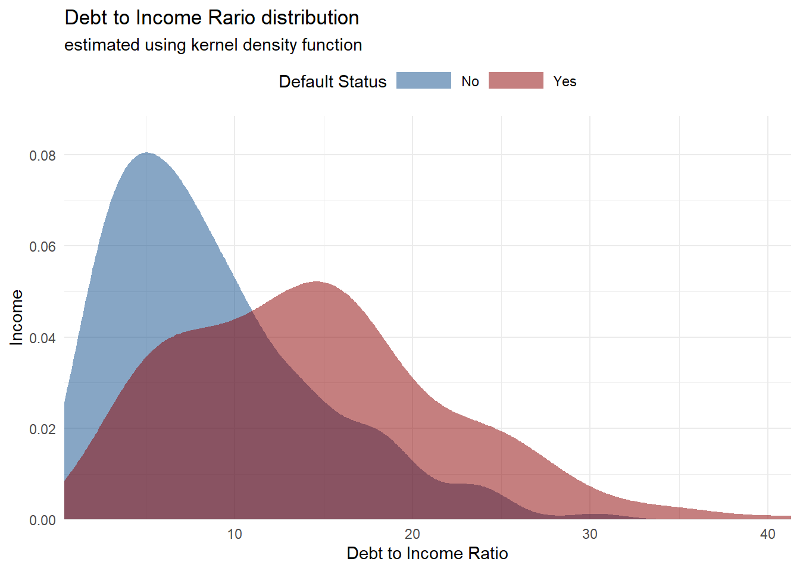
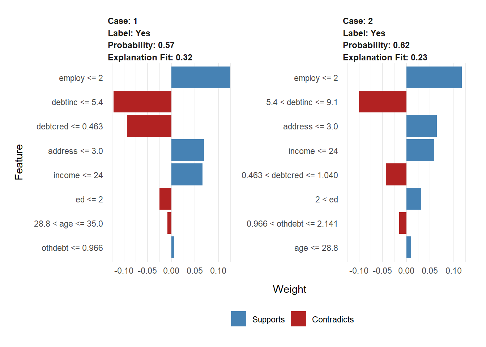

# Finance


<style>
body {
text-align: justify}
</style>


## Credit Risk Analysis 

### Background

Credit scoring membutuhkan berbagai data profil calon peminjam sehingga tingkat resiko dapat dihitung dengan tepat. Semakin benar dan lengkap data yang disediakan, maka semakin akurat perhitungan yang dilakukan. Proses tersebut tentunya merupakan hal yang baik, namun di sisi calon peminjam proses yang harus dilalui dirasa sangat merepotkan dan membutuhkan waktu untuk menunggu. Dan seiring tingkat kompetisi yang samkin tinggi di industri finansial, customer memiliki
banyak alternatif. Semakin cepat proses yang ditawarkan, semakin tinggi kesempatan untuk mendapatkan peminjam.

Tantangan pun muncul, bagaimana mendapatkan pelanggan dengan proses yang efisien namun akurasi dari credit scoring tetap tinggi. Disinilah machine learning dapat membantu menganalisa datadata profil peminjam dan proses pembayaran sehingga dapat mengeluarkan rekomendasi profil pelanggan yang beresiko rendah.

Harapannya setelah mempunyai model machine learning dengan perfomance model yang baik, pegawai bank dapat dengan mudah mengidentifikasi karakteristik customer yang memiliki peluang besar untuk melunasi pinjaman dengan lancar. Dengan adanya model machine learning ini tentunya akan mengurangi biaya dan waktu yang lebih cepat.

### Modelling Analysis


```r
loan <- read_csv("assets/02-finance/bankloans-copy.csv")%>% 
  mutate(default = factor(default, levels = c(0,1),
                          labels = c("No","Yes"))) %>% 
  rename(debtcred = creddebt)
glimpse(loan)
```

```
#> Observations: 800
#> Variables: 9
#> $ age      <dbl> 37, 25, 37, 29, 38, 32, 51, 27, 31, 37, 34, 31, 30, 31, 28, …
#> $ ed       <dbl> 1, 4, 3, 1, 2, 1, 2, 3, 1, 1, 4, 1, 1, 1, 2, 1, 1, 1, 4, 2, …
#> $ employ   <dbl> 20, 0, 16, 1, 13, 8, 22, 3, 1, 5, 7, 3, 11, 1, 1, 6, 14, 10,…
#> $ address  <dbl> 2, 1, 14, 8, 0, 6, 23, 4, 1, 11, 15, 5, 1, 6, 4, 9, 8, 0, 2,…
#> $ income   <dbl> 56, 18, 50, 31, 59, 26, 120, 35, 24, 27, 40, 16, 33, 21, 16,…
#> $ debtinc  <dbl> 1.9, 33.4, 36.6, 8.0, 2.4, 4.1, 7.6, 13.3, 4.5, 9.4, 6.4, 32…
#> $ debtcred <dbl> 0.542640, 2.801592, 7.320000, 0.156240, 0.407808, 0.326196, …
#> $ othdebt  <dbl> 0.521360, 3.210408, 10.980000, 2.323760, 1.008192, 0.739804,…
#> $ default  <fct> No, Yes, Yes, No, No, No, No, No, No, NA, No, NA, No, Yes, N…
```


```r
head(loan)
```

```
#> # A tibble: 6 x 9
#>     age    ed employ address income debtinc debtcred othdebt default
#>   <dbl> <dbl>  <dbl>   <dbl>  <dbl>   <dbl>    <dbl>   <dbl> <fct>  
#> 1    37     1     20       2     56     1.9    0.543   0.521 No     
#> 2    25     4      0       1     18    33.4    2.80    3.21  Yes    
#> 3    37     3     16      14     50    36.6    7.32   11.0   Yes    
#> 4    29     1      1       8     31     8      0.156   2.32  No     
#> 5    38     2     13       0     59     2.4    0.408   1.01  No     
#> 6    32     1      8       6     26     4.1    0.326   0.740 No
```


#### Exploratory Data Analysis

1. Eksplorasi hubungan target variabel dengan variabel prediktor


```r
loan %>% 
  na.omit() %>% 
ggplot(aes(x = debtinc, fill = default)) +
  geom_density(alpha = 0.5, colour = FALSE) +
  scale_x_continuous(
    expand = expand_scale(mult = c(0, 0))
  ) +
  scale_y_continuous(expand = expand_scale(mult = c(0, 0.1))) +
  scale_fill_manual(values = c("dodgerblue4","darkred")) +
  labs(
    title = "Debt to Income Rario distribution",
    subtitle = "estimated using kernel density function",
    x = "Debt to Income Ratio",
    y = "Income",
    fill = "Default Status"
  ) +
  theme_minimal() +
  theme(
    legend.position = "top",
    legend.key.height = unit(12, "pt"),
    legend.key.width = unit(36, "pt"),
  )
```




```r
loan %>% 
  na.omit() %>% 
ggplot(aes(x = debtcred, y = income)) +
  geom_point(color = "darkred") +
  geom_smooth(method = "loess", se = FALSE, color = "dodgerblue4") +
  facet_wrap(facets = vars(default), labeller = "label_both") +
  scale_y_continuous(labels = dollar_format(scale = 1e-3, suffix = "K")) +
  labs(
    title = "The relation of credit to debt ratio and income",
    subtitle = "for each default status",
    x = "Debt to Credit Ratio",
    y = "Income"
  ) +
  theme_minimal()
```


2. Check missing value


```r
loan %>% 
  is.na() %>% 
  colSums() %>% 
  enframe() %>% 
  arrange(desc(value))
```

```
#> # A tibble: 9 x 2
#>   name     value
#>   <chr>    <dbl>
#> 1 default    150
#> 2 age          0
#> 3 ed           0
#> 4 employ       0
#> 5 address      0
#> 6 income       0
#> 7 debtinc      0
#> 8 debtcred     0
#> 9 othdebt      0
```
Berikutnya akan digunakan data observasi tanpa adanya data missing value


```r
loan <- loan %>% 
  na.omit()
```

#### Modelling

Split data train dan data test dengan proporsi 80:20.

```r
set.seed(100)
intrain_loan <- initial_split(data = loan, prop = 0.8, strata = "default")
train_loan <- training(intrain_loan)
test_loan <- testing(intrain_loan)
```

Cek proporsi dari target variabel

```r
prop.table(table(train_loan$default))
```

```
#> 
#>        No       Yes 
#> 0.6149425 0.3850575
```

Untuk membuat data observasi menjadi lebih seimbang, dapat dilakukan upSample dari package caret.

```r
set.seed(47)
train_loan_up <- upSample(x = select(train_loan, -default),
                  y = train_loan$default, 
                  yname = "default")

prop.table(table(train_loan_up$default))
```

```
#> 
#>  No Yes 
#> 0.5 0.5
```

Bentuk model random forest dengan 5 k-fold dan 3 repetition

```r
set.seed(47)

ctrl <- trainControl(method = "repeatedcv",
                     number = 5, 
                     repeats = 3,
                     allowParallel=FALSE)

model_forest <- caret::train(default ~.,
                             data = train_loan_up, 
                             method = "rf", 
                             trControl = ctrl)
```


```r
model_forest
```

```
#> Random Forest 
#> 
#> 642 samples
#>   8 predictor
#>   2 classes: 'No', 'Yes' 
#> 
#> No pre-processing
#> Resampling: Cross-Validated (5 fold, repeated 3 times) 
#> Summary of sample sizes: 514, 513, 513, 514, 514, 513, ... 
#> Resampling results across tuning parameters:
#> 
#>   mtry  Accuracy   Kappa    
#>   2     0.8483850  0.6967960
#>   5     0.8359335  0.6718959
#>   8     0.8317749  0.6635641
#> 
#> Accuracy was used to select the optimal model using the largest value.
#> The final value used for the model was mtry = 2.
```

Setelah dilakukan 3 repetition pada model, repetition pertama memiliki accuracy paling besar dengan jumlah mtry sebanyak 2. Confusion matrix yang diperoleh data observasi yang tidak digunakan sebagai sampel diperoleh sebagai berikut:


```r
model_forest$finalModel
```

```
#> 
#> Call:
#>  randomForest(x = x, y = y, mtry = param$mtry) 
#>                Type of random forest: classification
#>                      Number of trees: 500
#> No. of variables tried at each split: 2
#> 
#>         OOB estimate of  error rate: 12.15%
#> Confusion matrix:
#>      No Yes class.error
#> No  269  52  0.16199377
#> Yes  26 295  0.08099688
```

Selanjutnya akan dilakukan prediksi untuk data test dan mencari nilai confusion matrix pada hasil prediksi.

```r
test_loan <- test_loan %>% 
  mutate(pred_forest = predict(model_forest, newdata = test_loan))
```


```r
confmat_loan_tune <- confusionMatrix(test_loan$pred_forest, 
                                 test_loan$default,
                                 mode = "prec_recall",
                                 positive = "Yes")

eval_rf <- tidy(confmat_loan_tune) %>% 
  mutate(model = "Random Forest") %>% 
  select(model, term, estimate) %>% 
  filter(term %in% c("accuracy", "precision", "recall", "specificity"))

eval_rf
```

```
#> # A tibble: 4 x 3
#>   model         term        estimate
#>   <chr>         <chr>          <dbl>
#> 1 Random Forest accuracy       0.836
#> 2 Random Forest specificity    0.886
#> 3 Random Forest precision      0.804
#> 4 Random Forest recall         0.755
```
Dari hasil confusion matrix dapat diketahui, kemampuan model memprediksi target variabel dapat dikatakan cukup baik. Selanjutnya kita akan mengetahui variable importance pada model yang diperoleh.


```r
plot(varImp(model_forest),main = "Variable Importance",)
```


Dapat diketahui variabel debtinc, employ, debtcred, othdebt, dan income merupakan 5 variable yang paling berpengaruh dan paling sering digunakan dalam pembuatan pohon.

### Recommendation


```r
eval_rf
```

```
#> # A tibble: 4 x 3
#>   model         term        estimate
#>   <chr>         <chr>          <dbl>
#> 1 Random Forest accuracy       0.836
#> 2 Random Forest specificity    0.886
#> 3 Random Forest precision      0.804
#> 4 Random Forest recall         0.755
```
Model machine learning untuk memprediksi kredit pinjaman customer yang lancar dan tidak lancar memiliki perfomance model yang cukup baik. Nantinya, pegawai bank dapat menggunakan model tersebut dengan mengisikan data pribadi setiap customer, kemudian hasil yang diperoleh dapat di visualisasikan sebagai berikut:


```r
library(lime)
train_x <- train_loan %>% 
  select(-c(default))
test_x <- test_loan %>% 
  select(-c(default, pred_forest))

explainer <- lime(test_x, model_forest)
explanation <- lime::explain(test_x[2:3,],
                             explainer, 
                             labels = c("Yes"),
                             n_features = 8)

plot_features(explanation)
```



Hasil visualisasi tersebut adalah contoh prediksi salah satu customer, customer tersebut terprediksi yes yang memiliki arti customer tersebut berpeluang besar sebagai customer yang lancar melunasi pembayaran. Tentunya ketika hasil prediksi menyatakan customer tersebut berpeluang besar untuk kredit lancar, artinya bank akan memberikan pinjaman kepada customer tersebut. Dari hasil visual tersebut juga ditunjukkan variabel mana yang support dan contradicts terhadap hasil prediksi yang dihasilkan.

