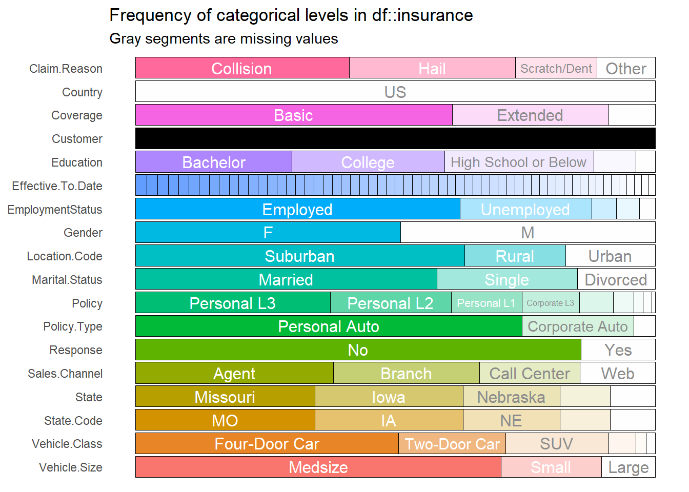
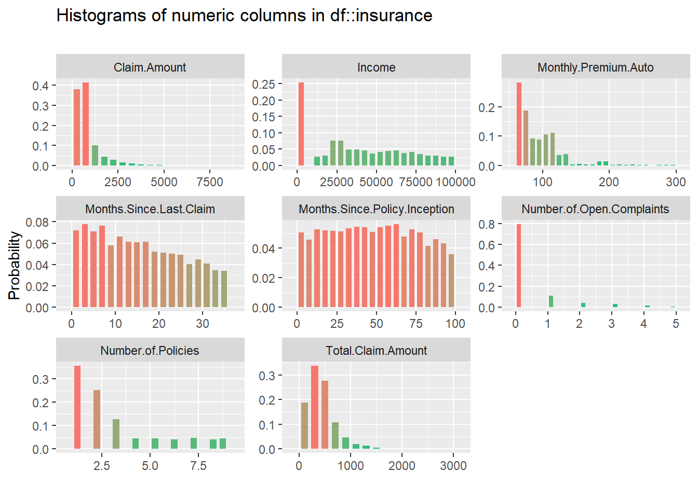
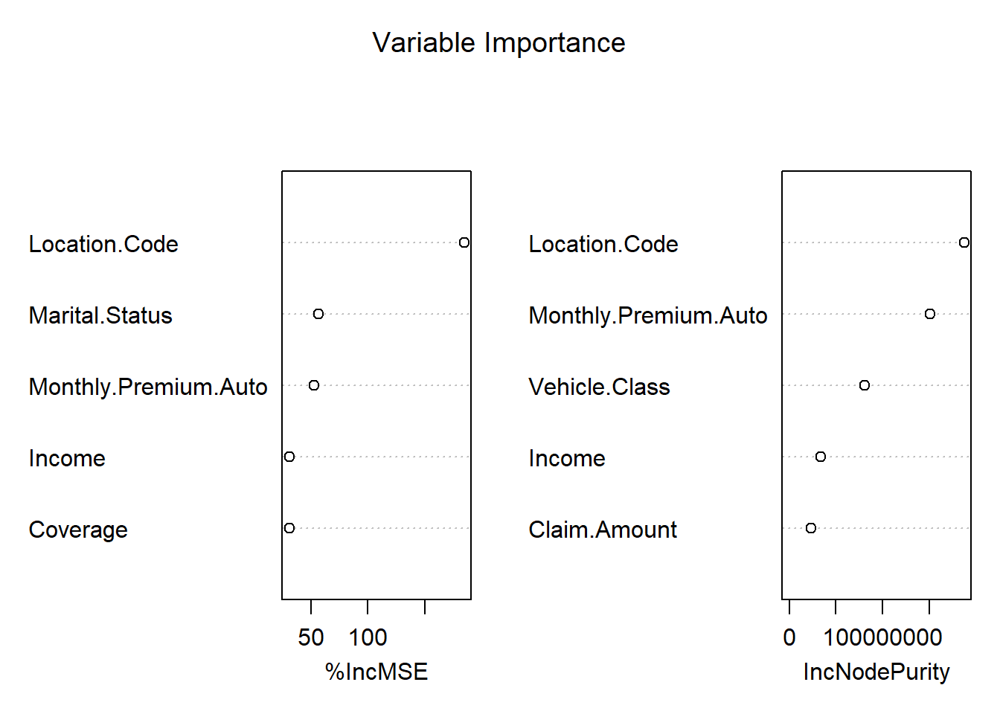

# Insurance


## Prediction of Total Claim Amount

### Background

Seiring tingkat kompetisi yang semakin tinggi di industri asuransi, perusahaan dituntut untuk selalu memberikan terobosan dan strategi untuk memberikan layanan yang terbaik untuk nasabahnya. Salah satu aset utama perusahaan asuransi tentunya adalah data nasabah dan riwayat polis. Tentunya dengan adanya data yang dimiliki oleh perusahaan, dapat dimanfaatkan dalam upaya pengambilan keputusan strategis.

Perusahaan memiliki kebutuhan untuk memperhitungkan pembayaran klaim di masa depan. Tanggung jawab tersebut biasa dikenal sebagai cadangan klaim. Karena cadangkan klaim adalah kewajiban yang harus dipersiapkan untuk masa yang akan datang, nilai pastinya tidak diketahui dan harus diperkirakan.

Risiko yang dimiliki oleh setiap nasabah tentunya bervariasi, faktor-faktor yang berhubungan dengan risiko tentunya membantu dalam memprediksi biaya klaim yang harus dibayarkan. Tujuan dari analysis ini adalah untuk memprediksi besarnya klaim yang harus diberikan oleh perusahaan untuk setiap nasabahnya, hasil prediksi diperoleh dengan mempelajari karakteristik dan profil dari nasabah tersebut.

### Modelling Analysis

#### Import Data

Data yang digunakan merupakan profil data nasabah asuransi kendaraan beserta total claim dari masing-masing nasabah yang diperoleh dari [link berikut.](https://github.com/ccpintoiu/Prediction-of-Claim-Amount-in-Vehicle-Insurance) Data tersebut berisikan 9134 observasi atau sebanyak jumlah nasabah yang dimiliki, beserta 26 kolom. Target variabel pada data ini adalah `Total.Claim.Amount`, kita akan memprediksi total claim amount untuk setiap nasabah, harapannya perusahaan asuransi dapat mengetahui dana yang harus disiapkan untuk membayar klaim.


```r
insurance <- read.csv("assets/04-insurance/Auto_Insurance_Claims_Sample.csv")  
head(insurance)
```

```
#>   Customer Country State.Code    State Claim.Amount Response Coverage Education
#> 1  BU79786      US         KS   Kansas     276.3519       No    Basic  Bachelor
#> 2  QZ44356      US         NE Nebraska     697.9536       No Extended  Bachelor
#> 3  AI49188      US         OK Oklahoma    1288.7432       No  Premium  Bachelor
#> 4  WW63253      US         MO Missouri     764.5862       No    Basic  Bachelor
#> 5  HB64268      US         KS   Kansas     281.3693       No    Basic  Bachelor
#> 6  OC83172      US         IA     Iowa     825.6298      Yes    Basic  Bachelor
#>   Effective.To.Date EmploymentStatus Gender Income Location.Code Marital.Status
#> 1           2/24/11         Employed      F  56274      Suburban        Married
#> 2           1/31/11       Unemployed      F      0      Suburban         Single
#> 3           2/19/11         Employed      F  48767      Suburban        Married
#> 4           1/20/11       Unemployed      M      0      Suburban        Married
#> 5            2/3/11         Employed      M  43836         Rural         Single
#> 6           1/25/11         Employed      F  62902         Rural        Married
#>   Monthly.Premium.Auto Months.Since.Last.Claim Months.Since.Policy.Inception
#> 1                   69                      32                             5
#> 2                   94                      13                            42
#> 3                  108                      18                            38
#> 4                  106                      18                            65
#> 5                   73                      12                            44
#> 6                   69                      14                            94
#>   Number.of.Open.Complaints Number.of.Policies    Policy.Type       Policy
#> 1                         0                  1 Corporate Auto Corporate L3
#> 2                         0                  8  Personal Auto  Personal L3
#> 3                         0                  2  Personal Auto  Personal L3
#> 4                         0                  7 Corporate Auto Corporate L2
#> 5                         0                  1  Personal Auto  Personal L1
#> 6                         0                  2  Personal Auto  Personal L3
#>   Claim.Reason Sales.Channel Total.Claim.Amount Vehicle.Class Vehicle.Size
#> 1    Collision         Agent           384.8111  Two-Door Car      Medsize
#> 2 Scratch/Dent         Agent          1131.4649 Four-Door Car      Medsize
#> 3    Collision         Agent           566.4722  Two-Door Car      Medsize
#> 4    Collision   Call Center           529.8813           SUV      Medsize
#> 5    Collision         Agent           138.1309 Four-Door Car      Medsize
#> 6         Hail           Web           159.3830  Two-Door Car      Medsize
```

#### Exploratory Data

Selanjutnya melihat structure data dari masing-masing variabel, jika terdapat variabel yang belum sesuai tipe datanya perlu dilakukan `explicit coercion`.


```r
str(insurance)
```

```
#> 'data.frame':	9134 obs. of  26 variables:
#>  $ Customer                     : Factor w/ 9134 levels "AA10041","AA11235",..: 601 5947 97 8017 2489 4948 8434 756 1352 548 ...
#>  $ Country                      : Factor w/ 1 level "US": 1 1 1 1 1 1 1 1 1 1 ...
#>  $ State.Code                   : Factor w/ 5 levels "IA","KS","MO",..: 2 4 5 3 2 1 1 4 1 1 ...
#>  $ State                        : Factor w/ 5 levels "Iowa","Kansas",..: 2 4 5 3 2 1 1 4 1 1 ...
#>  $ Claim.Amount                 : num  276 698 1289 765 281 ...
#>  $ Response                     : Factor w/ 2 levels "No","Yes": 1 1 1 1 1 2 2 1 2 1 ...
#>  $ Coverage                     : Factor w/ 3 levels "Basic","Extended",..: 1 2 3 1 1 1 1 3 1 2 ...
#>  $ Education                    : Factor w/ 5 levels "Bachelor","College",..: 1 1 1 1 1 1 2 5 1 2 ...
#>  $ Effective.To.Date            : Factor w/ 59 levels "1/1/11","1/10/11",..: 48 25 42 13 53 18 48 10 19 40 ...
#>  $ EmploymentStatus             : Factor w/ 5 levels "Disabled","Employed",..: 2 5 2 5 2 2 2 5 3 2 ...
#>  $ Gender                       : Factor w/ 2 levels "F","M": 1 1 1 2 2 1 1 2 2 1 ...
#>  $ Income                       : int  56274 0 48767 0 43836 62902 55350 0 14072 28812 ...
#>  $ Location.Code                : Factor w/ 3 levels "Rural","Suburban",..: 2 2 2 2 1 1 2 3 2 3 ...
#>  $ Marital.Status               : Factor w/ 3 levels "Divorced","Married",..: 2 3 2 2 3 2 2 3 1 2 ...
#>  $ Monthly.Premium.Auto         : int  69 94 108 106 73 69 67 101 71 93 ...
#>  $ Months.Since.Last.Claim      : int  32 13 18 18 12 14 0 0 13 17 ...
#>  $ Months.Since.Policy.Inception: int  5 42 38 65 44 94 13 68 3 7 ...
#>  $ Number.of.Open.Complaints    : int  0 0 0 0 0 0 0 0 0 0 ...
#>  $ Number.of.Policies           : int  1 8 2 7 1 2 9 4 2 8 ...
#>  $ Policy.Type                  : Factor w/ 3 levels "Corporate Auto",..: 1 2 2 1 2 2 1 1 1 3 ...
#>  $ Policy                       : Factor w/ 9 levels "Corporate L1",..: 3 6 6 2 4 6 3 3 3 8 ...
#>  $ Claim.Reason                 : Factor w/ 4 levels "Collision","Hail",..: 1 4 1 1 1 2 1 1 1 2 ...
#>  $ Sales.Channel                : Factor w/ 4 levels "Agent","Branch",..: 1 1 1 3 1 4 1 1 1 2 ...
#>  $ Total.Claim.Amount           : num  385 1131 566 530 138 ...
#>  $ Vehicle.Class                : Factor w/ 6 levels "Four-Door Car",..: 6 1 6 5 1 6 1 1 1 1 ...
#>  $ Vehicle.Size                 : Factor w/ 3 levels "Large","Medsize",..: 2 2 2 2 2 2 2 2 2 2 ...
```

Berikutnya kita perlu inspect persebaran data yang dimilih baik data kategorik dan numerik, kita dapat menggunakan package `inspectdf` untuk eksplorasi berikut ini.

```r
insurance %>% inspect_cat() %>% show_plot()
```




```r
insurance %>% inspect_num() %>% show_plot()
```



Dari hasil kedua plot diatas berikutnya membuang variabel yang tidak dibutuhkan dalam model. Variabel `customer` merupakan data unique dari ID setiap customer, oleh karena itu kita akan membuang variabel tersebut. Variabel `country` tidak banyak memberikan informasi, karena semua observasi berisikan informasi yang sama. Variabel `State.Code` juga memberikan informasi yang sama dengan variabel `State`, oleh karena itu kita akan menggunakan salah satu dari kedua variabel tersebut yaitu variabel `State`. Sedangkan untuk variabel `Policy` kita hilangkan karena informasi yang diberikan juga sama dengan variabel `Policy.Type`.


```r
insurance <- insurance %>% 
  select(-c(Customer, Country, State.Code,
            Effective.To.Date, Policy))
```


Selanjutnya, split data menjadi data train dan data test dengan proporsi 80:20.


```r
set.seed(100)
idx <- initial_split(data = insurance,prop = 0.8)
claim_train <- training(idx)
claim_test <- testing(idx)
```

#### Modelling

Kemudian bentuk model random forest, tentukan target variabel dan prediktor yang digunakan.

```r
library(randomForest)
forest_claim <- randomForest(Total.Claim.Amount~.,data = claim_train, localImp = TRUE)
#saveRDS(forest_claim,"forest_claim.RDS")
```


```r
forest_claim <- readRDS("assets/04-insurance/forest_claim.RDS")
forest_claim
```

```
#> 
#> Call:
#>  randomForest(formula = Total.Claim.Amount ~ ., data = claim_train,      localImp = TRUE) 
#>                Type of random forest: regression
#>                      Number of trees: 500
#> No. of variables tried at each split: 6
#> 
#>           Mean of squared residuals: 12764.93
#>                     % Var explained: 84.8
```

Model memiliki kemampuan menjelaskan variasi data sebesar 84.8%, sedangkan sisanya sebesar 15.2% dijelaskan oleh variabel lain yang tidak digunakan pada model. Untuk mengetahui variabel yang paling berpengaruh pada model, kita dapat melihat `variabel importance`. 

```r
varImpPlot(forest_claim, main = "Variable Importance",n.var = 5)
```



Nilai importance atau tingkat kepentingannya terdapat dua penilaian yaitu `IncMSE` dan `IncNodePurity`. Untuk `IncMSE` diperoleh dari error pada OOB (out of bag) data, kemudian di rata-ratakan untuk semua pohon, dan dinormalisasi dengan standar deviasi. Untuk `IncNodePurity` merupakan total penurunan impurity dari masing-masing variabel. Untuk kasus klasifikasi node impurity diperoleh dari nilai gini index, sedangkan untuk kasus regresi diperoleh dari SSE (Sum Square Error).

Untuk mengetahui peran variabel dalam pembuatan model, kita dapat memanfaatkan package `randomForestExplainer` yang menyediakan beberapa function untuk memperoleh informasi mengenai variabel importance.

```r
mindepth_frame <- min_depth_distribution(forest_claim)
#saveRDS(mindepth_frame, "mindepthframe.rds")
```


```r
mindepth_frame <- readRDS("assets/04-insurance/mindepthframe.rds")
plot_min_depth_distribution(mindepth_frame, mean_sample = "top_trees")
```


Plot tersebut memberikan informasi mengenai nilai `mean minimal dept` untuk setiap variabel. Semakin kecil nilai minimal depth artinya semakin penting variabel tersebut pada model. Semakin besar proporsi minimal dept pada warna merah mudah (mendekati 0), artinya variabel tersebut sering dijadikan sebagai root node, yaitu variabel utama yang digunakan untuk menentukan nilai target.


```r
imp_frame <- measure_importance(forest_claim)
#saveRDS(imp_frame,"imp_frame.rds")
```


```r
imp_frame <- readRDS("assets/04-insurance/imp_frame.rds")
plot_multi_way_importance(imp_frame, size_measure = "no_of_nodes",no_of_labels = 6)
```


```r
plot_multi_way_importance(imp_frame, x_measure = "mse_increase",
                          size_measure = "p_value", no_of_labels = 6)
```


Perbandingan dari ketiga plot, terdapat 5 variabel yaitu location code, monthly premium auto, vehicle class, income, dan claim amount yang selalu muncul dari ketiga plot tersebut. Artinya kelima variabel tersebut dapat dikatakan variabel yang paling berpengaruh dan banyak digunakan dalam pembuatan pohon.

Berikutnya lakukan prediksi untuk data test, kemudian cari nilai error dari hasil prediksi

```r
claim_test$pred <- predict(object = forest_claim,newdata = claim_test)
```

Mencari nilai RMSE (Root Mean Squared Error)

```r
RMSE(y_pred = claim_test$pred,y_true = claim_test$Total.Claim.Amount)
```

```
#> [1] 62.59351
```

RMSE merupakan nilai rata rata dari jumlah kuadrat error yang menyatakan ukuran besarnya kesalahan yang dihasilkan oleh model. Nilai RMSE rendah menunjukkan bahwa variasi nilai yang dihasilkan oleh model mendekasi variasi nilai observasinya. Jika dilihat dari 5 number summary variabel total claim amount, nilai RMSE yang diperoleh sebesar 119.9 dapat dikatakan sudah cukup baik.

### Conclusion

Untuk memprediksi nilai `Total Claim Amount` model ini memiliki kemampuan menjelaskan variasi data sebesar 84.8% dan variabel yang paling mempengaruhi target adalah variabel location code, monthly premium auto, vehicle class, income, dan claim amount. Hasil error yang diperoleh dari model tersebut cukup baik dalam memprediksi data.
